# Capturas de Telas

As capturas abaixo apresentam a versão visual e navegável do protótipo do **RankFlow**, mostrando as principais telas, componentes de interface, elementos de entrada de dados e fluxos implementados na Etapa 2.

## Captura 01 — Boas-vindas

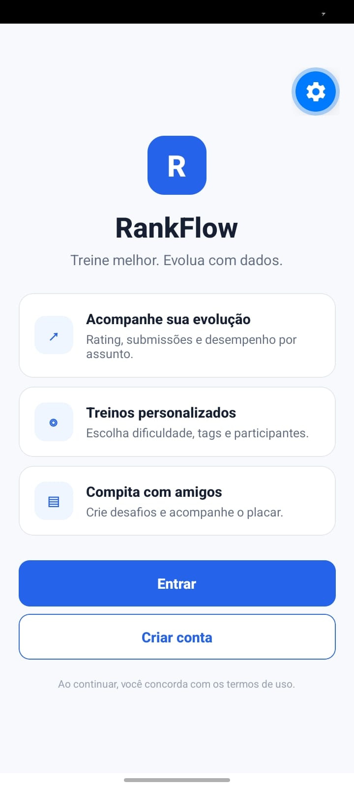

Apresenta a tela inicial do RankFlow, com a identidade visual da aplicação, uma breve descrição da proposta do sistema e três destaques de funcionalidades: acompanhamento da evolução, treinos personalizados e competição com amigos. Também são exibidos os botões **Entrar** e **Criar conta**, responsáveis por iniciar os fluxos de autenticação.

## Captura 02 — Login

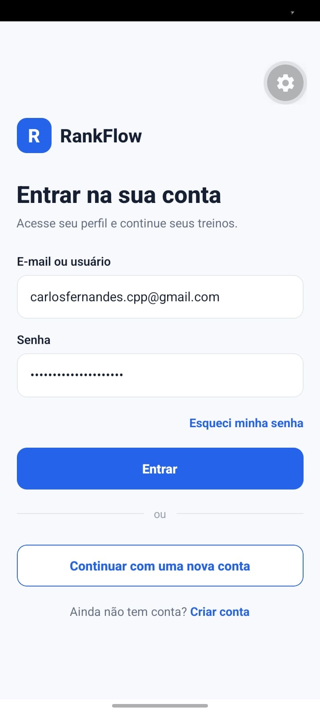

Mostra a tela de autenticação do usuário. A interface possui campos para **e-mail ou usuário** e **senha**, além das opções **Esqueci minha senha**, **Entrar**, **Continuar com uma nova conta** e acesso direto à criação de conta.

## Captura 03 — Recuperação de senha

Apresenta a tela de recuperação de senha, na qual o usuário informa seu e-mail para solicitar um link de redefinição. A captura também demonstra o retorno visual de confirmação após o envio do link.

## Captura 04 — Cadastro

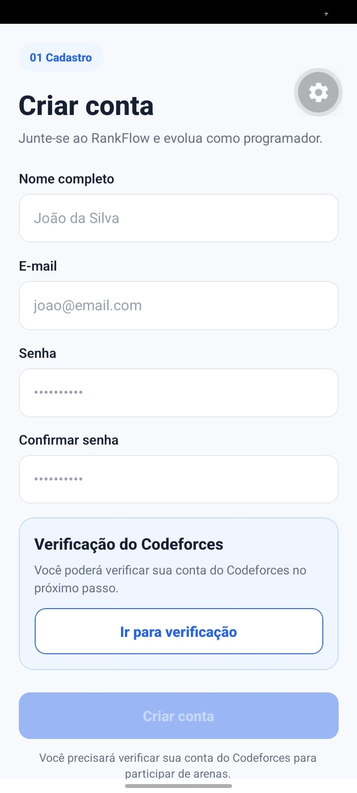

Mostra a tela de criação de conta, contendo campos para **nome completo**, **e-mail**, **senha** e **confirmação de senha**. A interface também apresenta a seção de verificação da conta do Codeforces e o botão para iniciar esse processo antes ou depois da criação da conta.

## Captura 05 — Conta do Codeforces encontrada

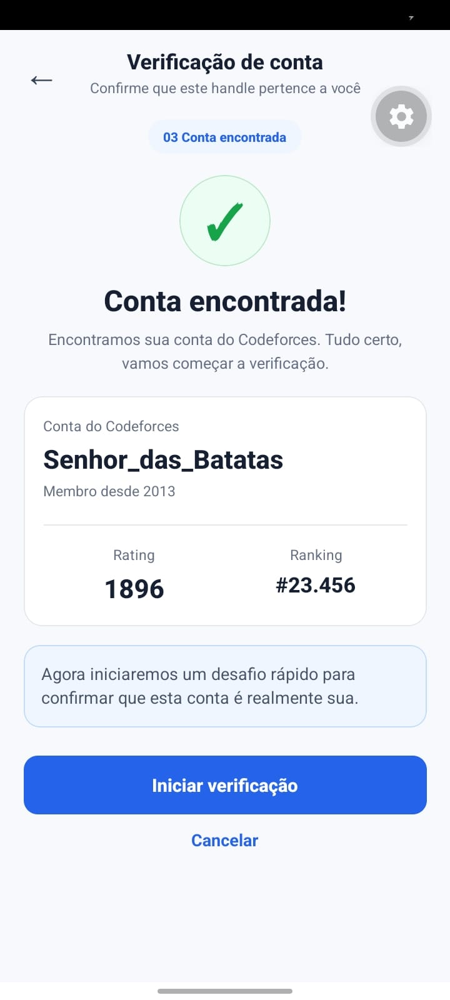

Apresenta a etapa de confirmação da conta encontrada no Codeforces. São exibidos dados do perfil localizado, como **handle**, ano de ingresso, **rating** e posição no ranking. O usuário pode confirmar a conta e iniciar o desafio de verificação.

## Captura 06 — Verificação em andamento

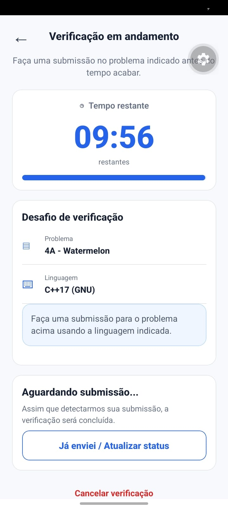

Mostra o processo de verificação da conta do Codeforces em execução. A tela exibe um cronômetro, o problema selecionado para o desafio, a linguagem de programação definida e o estado de espera por uma submissão. Também há opção para atualizar manualmente o status da verificação.

## Captura 07 — Conta verificada

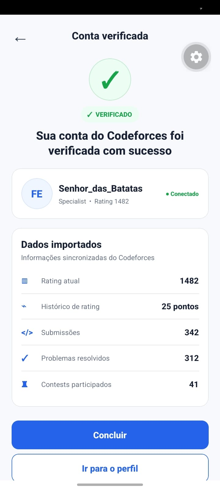

Apresenta o resultado de sucesso da verificação do Codeforces. A tela confirma que a conta foi vinculada e mostra informações importadas, como **rating atual**, histórico de rating, número de submissões, problemas resolvidos e competições participadas.

## Captura 08 — Verificação de conta do Codeforces

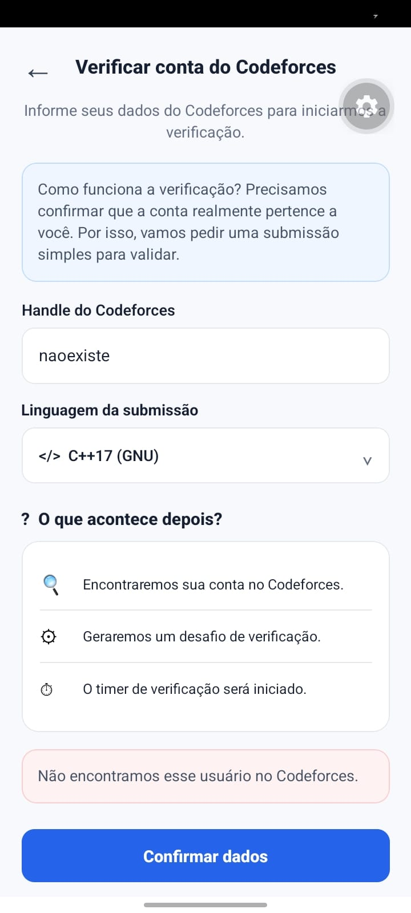

Mostra a tela inicial do fluxo de verificação, com campos para informar o **handle do Codeforces** e selecionar a **linguagem da submissão**. Também são apresentadas instruções resumidas sobre as etapas da verificação. Na captura, a interface demonstra ainda o tratamento visual para um usuário não encontrado.

## Captura 09 — Início

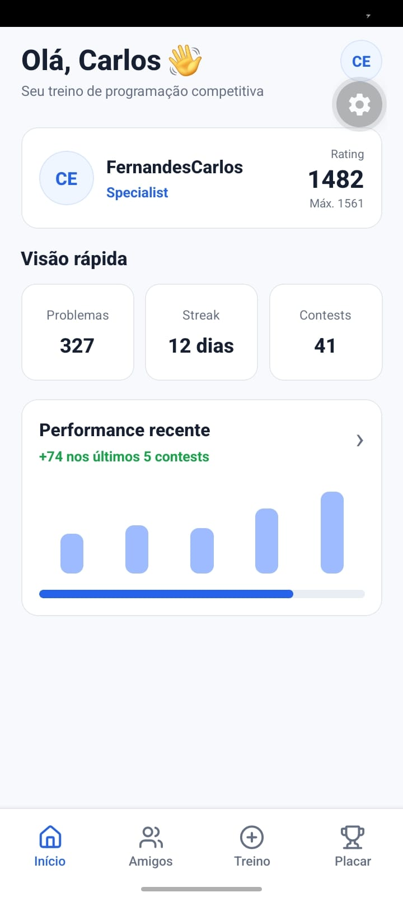

Apresenta a tela principal após o acesso ao aplicativo. São exibidos o perfil do usuário, rating atual, rating máximo, quantidade de problemas resolvidos, sequência de dias de atividade, número de competições e um resumo visual da performance recente. A barra inferior permite navegar entre as principais áreas do aplicativo.

## Captura 10 — Estatísticas por tags

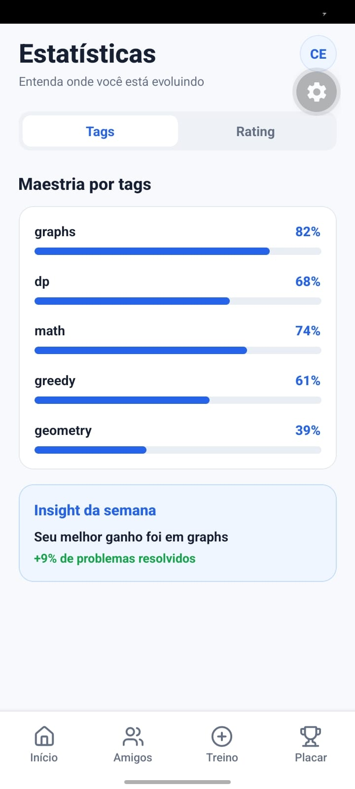

Mostra a seção de estatísticas com foco no desempenho por assunto. A interface apresenta barras de progresso para diferentes tags, como **graphs**, **dp**, **math**, **greedy** e **geometry**, além de um insight semanal sobre a evolução do usuário.

## Captura 11 — Estatísticas de rating

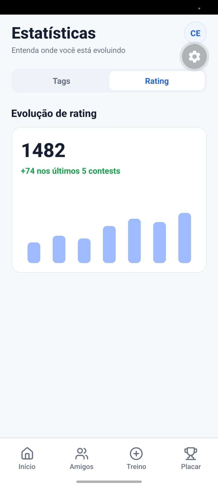

Apresenta a visualização da evolução de rating. A tela mostra o rating atual, a variação recente e um gráfico simplificado que representa o desempenho do usuário nas últimas competições.

## Captura 12 — Amigos

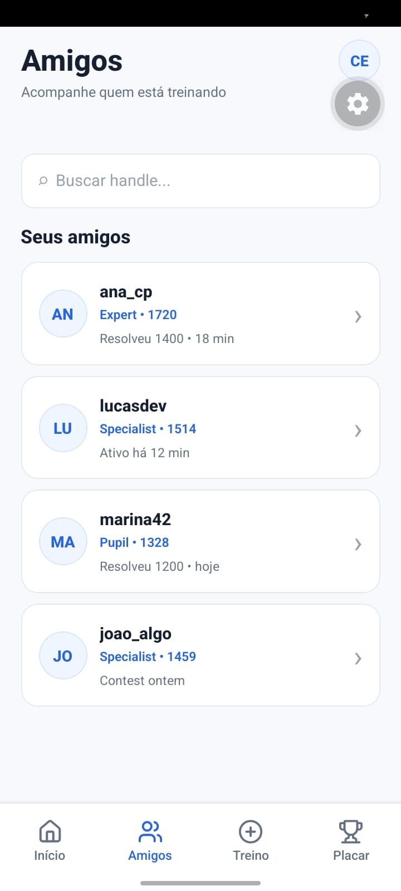

Mostra a tela de amigos, contendo um campo de busca por handle e uma lista de usuários adicionados. Cada item apresenta informações como nome de usuário, classificação, rating e atividade recente.

## Captura 13 — Criar treino

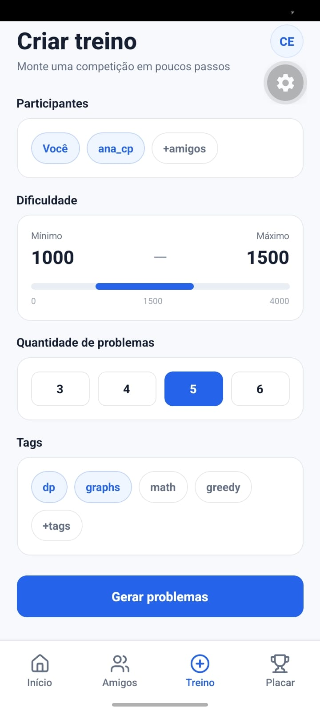

Apresenta a tela de configuração de um treino personalizado. O usuário pode definir os participantes, intervalo de dificuldade, quantidade de problemas e tags desejadas. Ao final, o botão **Gerar problemas** inicia a criação do treino de acordo com os critérios selecionados.

## Captura 14 — Perfil

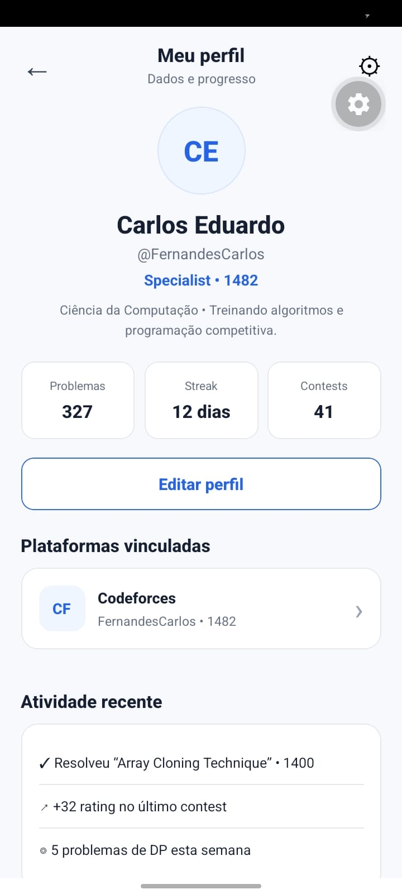

Mostra a tela de perfil do usuário, com nome, handle, classificação, rating, descrição pessoal e indicadores de desempenho. Também são exibidas a plataforma vinculada e atividades recentes, além do botão para editar os dados do perfil.

## Captura 15 — Editar perfil

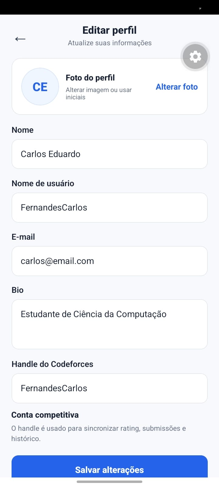

Apresenta o formulário de edição das informações pessoais. A tela permite alterar foto, nome, nome de usuário, e-mail, biografia e handle do Codeforces. O botão **Salvar alterações** representa a ação de confirmação dos dados modificados.

## Captura 16 — Plataformas

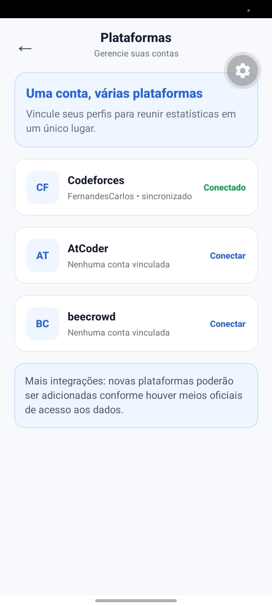

Mostra a tela destinada ao gerenciamento de plataformas de programação competitiva. A conta do **Codeforces** aparece conectada, enquanto **AtCoder** e **beecrowd** são apresentadas como integrações disponíveis para vinculação futura.

---

Essas capturas funcionam como evidência visual complementar da implementação do protótipo, demonstrando a organização das telas, a navegação, os componentes reutilizáveis, os elementos de entrada de dados e a consistência visual adotada no RankFlow.
