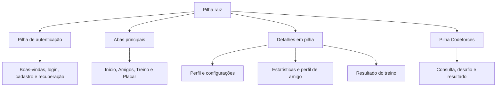

# Etapa 3 — Navegação, UX e acessibilidade

**Repositório:** https://github.com/FernandesCarlos/RankFlow  
**Tag exigida:** `etapa-03` (criada localmente; publicação remota pendente)

## Objetivo e escopo

Evoluir as telas da Etapa 2 com navegação completa, retorno coerente, feedback das ações e medidas de acessibilidade. O RankFlow continua sendo um protótipo de programação competitiva com dados simulados. Não há backend nem autenticação real. Alterações de perfil, preferências e treino ficam em memória enquanto a sessão estiver aberta; sair ou reiniciar restaura os dados iniciais.

## Estrutura de navegação

O projeto utiliza **Expo Router**, com rotas definidas pelos arquivos de `src/app`, e o componente **Stack** para a navegação em pilha. `Tabs` organiza as quatro áreas principais. A pilha raiz permite abrir detalhes por cima das abas e voltar ao conteúdo que já estava montado.



Os nomes entre parênteses, `(auth)` e `(tabs)`, agrupam rotas e não fazem parte da URL pública. O `index.tsx` escolhe a entrada conforme a sessão. `Stack.Protected` disponibiliza autenticação antes do login e as funcionalidades principais depois do login. Quando a sessão muda, as rotas que perderam acesso são removidas do histórico; voltar após sair não reabre o perfil.

A pilha do Codeforces é compartilhada com o cadastro e as configurações. A origem fica no contexto da sessão. A conclusão usa `dismissTo` para alcançar a tela existente e retirar as etapas intermediárias, preservando os campos do cadastro.

### Operações da pilha implementadas

| Operação | Uso concreto | Efeito |
| --- | --- | --- |
| `router.push` | Perfil → Editar; Amigos → perfil dinâmico; Treino → Resultado | Empilha uma tela e conserva a anterior |
| `router.back` | Chamado por `goBack` quando existe histórico | Remove o topo e revela a tela anterior |
| `router.canGoBack` | `src/navigation/actions.ts` | Verifica a existência de uma tela anterior |
| `router.replace` | Verificação → sucesso/falha; recuperação de rota inválida | Substitui a etapa transitória |
| `router.dismissTo` | Conclusão do Codeforces → cadastro/plataformas | Descarta etapas intermediárias até a origem; usa substituição se não houver a rota |
| `router.navigate` | Resultado → aba Placar | Seleciona uma área principal |
| `useLocalSearchParams` | Perfil de amigo e fluxo Codeforces | Lê os parâmetros da rota atual |
| `useFocusEffect` | Consultas e cronômetro do Codeforces | Desativa efeitos ao sair da tela |

Exemplo prático: Início → Perfil → Editar perfil. Ao salvar, o estado compartilhado é atualizado, uma mensagem de sucesso é registrada e `goBack('/perfil')` remove a edição. O perfil anterior reaparece com os novos dados. Acesso direto sem histórico usa um destino alternativo conhecido.

## Telas e mecanismos de acesso

| Tela / rota | Acesso | Retorno ou conclusão |
| --- | --- | --- |
| Boas-vindas `/boas-vindas` | Abertura sem sessão | Botões Entrar e Criar conta |
| Login `/login` | Boas-vindas ou cadastro | Voltar; entrar abre as abas |
| Cadastro `/cadastro` | Boas-vindas ou login | Voltar; criar conta abre as abas |
| Recuperação `/recuperar-senha` | Esqueci minha senha | Voltar ao login |
| Início `/` no grupo `(tabs)` | Login/cadastro ou aba Início | Avatar → Perfil; Performance → Estatísticas |
| Amigos `/amigos` | Aba Amigos | Busca e seleção de amigo |
| Perfil de amigo `/amigos/[handle]` | Card na lista de amigos | Voltar preserva a busca |
| Treino `/treino` | Aba Treino | Gerar problemas → Resultado |
| Resultado `/treinos/resultado` | Geração válida de treino | Ajustar opções ou abrir o placar |
| Placar `/placar` | Aba Placar ou Resultado | Troca de abas |
| Estatísticas `/estatisticas` | Performance recente no Início | Voltar ao Início; seletor Tags/Rating |
| Perfil `/perfil` | Avatar das áreas principais | Voltar; Editar; Configurações; Plataformas |
| Editar perfil `/perfil/editar` | Perfil ou Configurações | Salvar atualiza a sessão; Voltar descarta edição |
| Configurações `/configuracoes` | Engrenagem no perfil | Voltar; opções de conta e aplicativo |
| Notificações `/configuracoes/notificacoes` | Menu Configurações | Voltar; preferências mantidas na sessão |
| Informações `/configuracoes/informacoes?secao=…` | Privacidade, idioma, ajuda ou sobre | Voltar às configurações |
| Plataformas `/configuracoes/plataformas` | Perfil ou Configurações | Verificar Codeforces; Voltar |
| Consulta `/codeforces/verificar-conta` | Cadastro ou Plataformas | Cancelar/Voltar à origem |
| Conta encontrada `/codeforces/conta-encontrada` | Consulta válida | Iniciar verificação ou voltar |
| Verificação `/codeforces/verificacao` | Conta encontrada | Atualizar status, cancelar ou aguardar prazo |
| Sucesso `/codeforces/sucesso` | Verificação simulada concluída | Concluir e voltar à origem |
| Falha `/codeforces/falha` | Prazo esgotado | Tentar novamente, editar dados ou voltar à origem |
| Página não encontrada | Endereço inexistente | Voltar ao início |

## Menus, abas e orientação

As abas inferiores têm ícone e texto, área de toque mínima e destaque de seleção. O histórico de abas utiliza `backBehavior="history"`. A barra considera a safe area inferior e o tamanho de fonte; é ocultada durante a digitação. Estatísticas foi movida da antiga aba oculta para a pilha, passando a ter botão de retorno explícito.

A tela de configurações agrupa conta, preferências e informações. As opções sem ação da Etapa 2 foram substituídas por destinos funcionais. Tema escuro, outros idiomas e integrações adicionais são identificados como indisponíveis; não há interruptor que prometa mudar o tema sem aplicar a mudança.

## Feedback visual

- **Pressionado e foco:** `AccessiblePressable` altera a opacidade ao toque e mostra contorno quando recebe foco. Campos mudam a borda ao ganhar foco.
- **Seleção:** participantes e tags mostram marca de seleção, cor e estado de checkbox; quantidade usa estado de radio. As abas indicam a opção atual.
- **Carregamento:** consulta Codeforces mostra “Procurando…” e indicador; atualização mostra “Verificando…”. Os controles ficam indisponíveis durante a operação.
- **Validação:** login vazio, cadastro inválido, senhas divergentes, e-mail incorreto e dificuldade fora de intervalo exibem mensagens explicativas.
- **Sucesso:** perfil salvo, preferência alterada, conta demonstrativa criada e treino gerado recebem mensagens visíveis.
- **Estado vazio:** busca sem amigos, resultado sem treino e perfil de amigo inexistente apresentam orientação para continuar.
- **Falha e recuperação:** handle `naoexiste` produz erro de consulta; tempo esgotado abre Falha; resultados Codeforces sem handle oferecem reinício.
- **Simulação identificada:** recuperação informa que nenhum e-mail foi enviado; placar informa que os valores são estáticos; treino informa que os exercícios são demonstrativos.

Mensagens globais são exibidas apenas na tela em foco e permanecem até a ação “Fechar mensagem” ou até uma nova mensagem. Não desaparecem por um tempo curto que possa prejudicar a leitura.

## Decisões de UX e Lei de Fitts

A Lei de Fitts relaciona a dificuldade de alcançar um alvo à distância e ao tamanho desse alvo. O projeto aplica o princípio com controles maiores, posições previsíveis e agrupamento das ações relacionadas.

- Controles compartilhados têm área real mínima de **48 × 48 unidades lógicas**. Botões principais têm altura mínima de 50 e campos de 52. O retorno também oferece `hitSlop`.
- Toda a linha de preferência é acionável, e não apenas o interruptor pequeno. É um único elemento acessível.
- As ações principais têm texto explícito: “Salvar alterações”, “Gerar problemas”, “Concluir e voltar”.
- Abas frequentes ficam no rodapé; os detalhes têm retorno no topo. Ações relacionadas ficam próximas, com espaçamento entre opções.
- A navegação de detalhe conserva a tela anterior: a busca de amigos, as opções do treino e o formulário de cadastro não são recriados ao voltar.
- Perfil, preferências e treino usam um contexto React compartilhado. Salvar deixa de ser apenas uma mudança de tela e passa a atualizar os dados exibidos.
- Validações explicam o problema e a ação necessária; não dependem apenas de desabilitar o botão sem explicação.
- Acesso direto a telas sem dados tem saída conhecida, e rotas desconhecidas têm uma tela de recuperação.

## Medidas de acessibilidade

| Medida | Implementação |
| --- | --- |
| Nome dos controles | `accessibilityLabel` em botões, campos, avatar, retorno e configurações |
| Papel semântico | `button`, `header`, `tab`, `radio`, `checkbox`, `switch`, `progressbar` e `alert` conforme o controle |
| Estado | `accessibilityState` comunica seleção, marcado, desabilitado e ocupado |
| Progresso | `accessibilityValue` informa mínimo, máximo e valor atual |
| Mensagens | `accessibilityLiveRegion` para atualizações; `AccessibilityInfo.announceForAccessibility` no iOS para mensagens anunciáveis |
| Interruptores | Linha inteira acionável; switch visual oculto da árvore acessível para evitar duplicação |
| Campo com rótulo | Nome persistente associado por `accessibilityLabel`, independente do placeholder |
| Cor e contraste | Texto secundário, placeholder, sucesso e aviso com tons mais escuros; borda de campo e foco contrastantes |
| Sem depender só de cor | Texto de erro/sucesso e marca de seleção acompanham cores |
| Fonte e conteúdo | Escala de fonte do sistema preservada; controles com altura mínima e padding, rolagem e quebra de grupos |
| Dispositivo | Safe area e tratamento de teclado nos componentes compartilhados |

Os gráficos têm informação textual de rating, ganho e percentuais ao redor; barras decorativas não substituem esses valores. As barras de maestria têm rótulos por tag. A base foi preparada para leitores de tela, mas a experiência final com TalkBack e VoiceOver deve ser conferida em aparelho.

## Execução e testes

```bash
npm ci
npm run typecheck
npm test
npm run export:web
npm start
```

Versões mantidas do projeto: Expo SDK 57, React Native 0.86.3 e React 19.2.3. O lockfile registra as dependências de execução e testes. Node 22.13 ou superior; verificações desta entrega feitas com Node 24.

### Testes automatizados

`tests/domain.test.cjs` verifica entradas inválidas, senhas, quantidade, participantes, tags e limites do treino. `tests/navigation.test.tsx` usa as telas reais com `renderRouter` do Expo Router, acionando controles pelos nomes e papéis acessíveis. Os serviços continuam sendo as simulações do aplicativo; a navegação não é substituída por um mock de `router.push`.

A configuração Jest usa o preset oficial `jest-expo` e resolve os ícones Lucide para sua distribuição CommonJS no ambiente de teste. Os testes não ficam no diretório de rotas.

### Roteiro manual em aparelho

1. Abra o projeto no Expo Go compatível. Entre com qualquer usuário e senha fictícios não vazios. Confirme que login vazio mostra explicação.
2. Troque entre as quatro abas. Abra Estatísticas pelo Início, alterne Tags/Rating e volte.
3. Busque `ana` em Amigos, abra o perfil e volte. A busca deve continuar preenchida. Busque um handle inexistente e confira o estado vazio.
4. Em Treino, altere participantes, dificuldade, quantidade e tags. Gere a lista, confira as escolhas, volte e confira que as opções permaneceram. Teste máximo menor que mínimo e nenhuma tag selecionada.
5. Abra Perfil → Editar perfil, altere o nome e salve. Confirme os novos dados e a mensagem. Voltar sem salvar não deve aplicar a edição.
6. Em Configurações, entre em Notificações, altere uma preferência, volte e abra novamente. Desative a permissão geral: as opções dependentes devem ficar desabilitadas. Teste também Privacidade, Ajuda, Sobre e Idioma/aparência.
7. No cadastro, preencha nome/e-mail e abra a verificação Codeforces. `naoexiste` deve exibir erro. Outro handle deve avançar. Inicie e toque “Já enviei / Atualizar status”; conclua e confira os campos preservados.
8. Repita Codeforces a partir de Plataformas: a conclusão deve voltar a Plataformas, não ao cadastro. Cancele uma consulta antes de terminar e confirme que sua resposta não altera a tela de destino. Aguarde o prazo de uma verificação para conferir a tela de falha e a nova tentativa.
9. Saia da conta e use o retorno do Android. O perfil anterior não deve ficar acessível. Reinicie e confira que os dados em memória foram restaurados.
10. Ative **TalkBack (Android)** ou **VoiceOver (iOS)**. Navegue por toque/exploração: campos devem ser identificados, botões somente de ícone devem ter nomes claros, e opções devem anunciar marcado/selecionado/desabilitado. Confira se cada interruptor tem um único foco.
11. Com o leitor ativado, provoque erro e sucesso. Confira a leitura das mensagens e a disponibilidade de “Fechar mensagem”. Verifique a ordem de leitura ao abrir e voltar de uma tela.
12. Amplie a fonte do sistema e teste tela estreita, teclado aberto, rolagem e recortes/barras do aparelho. No navegador, use Tab e Enter para verificar foco visível e ativação de controles.

### Limites da validação

TypeScript, testes de domínio, testes de navegação e exportação web foram executados no ambiente de desenvolvimento. O acesso à prévia local pelo navegador disponível foi bloqueado; portanto não se declara inspeção visual interativa nem validação em Android/iOS físico. Testes automatizados de semântica e navegação não substituem os passos com TalkBack/VoiceOver, teclado, safe area e fonte ampliada acima.

## Versão da entrega

O código está publicado na branch `feature/etapa-03`, no mesmo repositório das etapas anteriores. A tag `etapa-03` foi criada no checkout local, mas não pôde ser enviada: o Git do terminal não tinha credenciais, e o conector disponível permitiu publicar a branch, mas não criar a tag. A exigência da tag remota permanece pendente.

Para obter o código e publicar a tag usando seu Git autenticado:

```bash
git clone --branch feature/etapa-03 https://github.com/FernandesCarlos/RankFlow.git
cd RankFlow
npm ci
npm start
```

Em um clone existente, primeiro execute `git fetch origin feature/etapa-03`. Crie a tag somente se ela ainda não existir:

```bash
git tag -a etapa-03 origin/feature/etapa-03 -m "Entrega da Etapa 3: navegação, UX e acessibilidade"
git push origin etapa-03
```

Não use `--force` nem sobrescreva uma tag existente. Após a publicação, a versão poderá ser consultada em `https://github.com/FernandesCarlos/RankFlow/tree/etapa-03`.

## Referências técnicas

- [Expo Router — Stack](https://docs.expo.dev/router/advanced/stack/)
- [Expo Router — rotas protegidas](https://docs.expo.dev/router/advanced/protected/)
- [Expo Router — testes](https://docs.expo.dev/router/reference/testing/)
- [React Native — acessibilidade](https://reactnative.dev/docs/accessibility)
