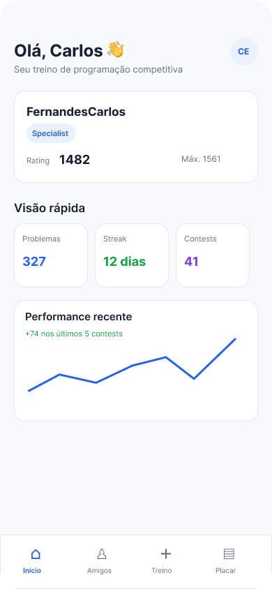
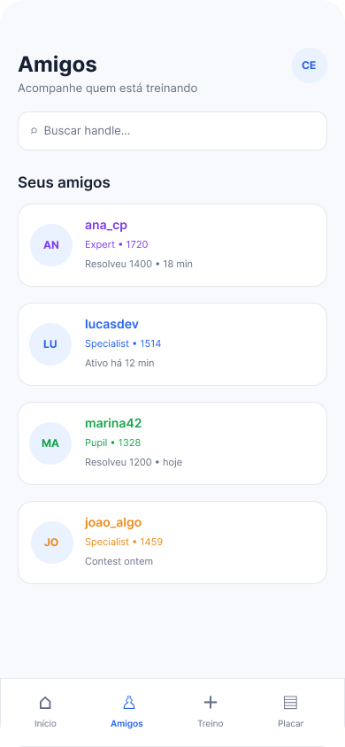
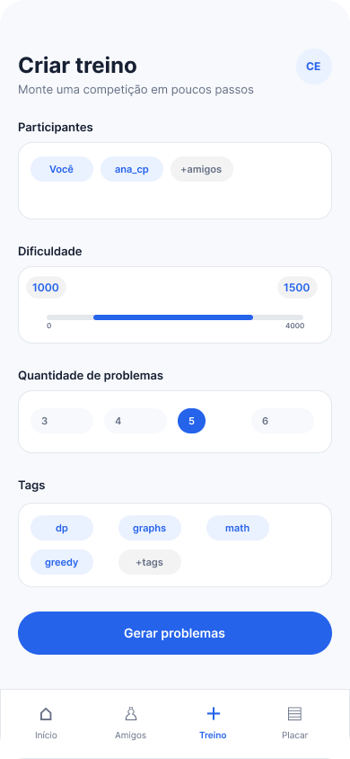
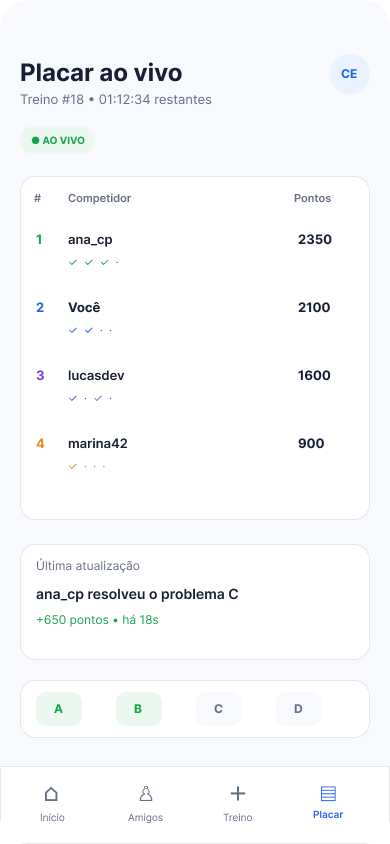
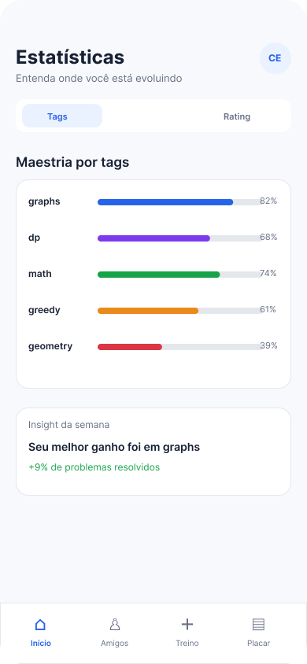

# RankFlow

Aplicativo mobile voltado para **programação competitiva**, com foco no acompanhamento de desempenho, criação de treinos personalizados, comparação entre usuários e realização de competições.

## Sobre o projeto

Plataformas de programação competitiva possuem uma grande quantidade de dados sobre problemas, submissões e competidores, mas nem sempre apresentam essas informações de forma simples, organizada e visual.

O **RankFlow** busca reunir essas informações em uma aplicação mobile, permitindo que os usuários acompanhem sua evolução, analisem estatísticas, comparem desempenho com amigos e participem de treinos e competições personalizadas.

Inicialmente, o RankFlow utilizará o **Codeforces** como principal plataforma para obtenção de dados. Futuramente, a proposta é expandir a aplicação para outras plataformas de programação competitiva, como **AtCoder** e **beecrowd**, permitindo que o usuário acompanhe seu desempenho em diferentes serviços por meio de uma única aplicação.

---

## Problema

Plataformas de programação competitiva disponibilizam muitas informações sobre usuários, problemas, submissões e competições, porém esses dados ficam distribuídos em diferentes páginas e nem sempre são apresentados de maneira simples e visual. Além disso, criar treinos personalizados, comparar o desempenho entre amigos e acompanhar competições próprias pode exigir diferentes ferramentas ou processos manuais.

O RankFlow busca centralizar essas funcionalidades em uma única aplicação mobile.

---

## Público-alvo

O aplicativo é voltado para:

- Pessoas interessadas em programação competitiva;
- Competidores de maratonas de programação;
- Usuários de plataformas como Codeforces;
- Pessoas que desejam acompanhar sua evolução em algoritmos e resolução de problemas;
- Grupos que desejam realizar treinos e competições entre amigos.

---

## Objetivo

O principal objetivo do RankFlow é facilitar o treinamento em programação competitiva por meio de uma aplicação mobile que reúna:

- Estatísticas de desempenho;
- Análise de desempenho por tags;
- Histórico de evolução e rating;
- Comparação entre usuários;
- Criação de treinos personalizados;
- Competições entre amigos;
- Acompanhamento de placares.

---

## Funcionalidades previstas

Entre as principais funcionalidades estão:

- Consulta de informações do perfil de um competidor;
- Visualização do rating atual;
- Visualização do histórico de rating;
- Quantidade de problemas resolvidos;
- Estatísticas de desempenho por tags, como:
  - Dynamic Programming;
  - Grafos;
  - Matemática;
  - Greedy;
  - Geometria;
- Visualização do nível de domínio por tag;
- Identificação dos assuntos com melhor e pior desempenho;
- Acompanhamento de amigos;
- Criação de treinos personalizados;
- Filtro de problemas por dificuldade;
- Filtro de problemas por tags;
- Seleção de participantes para treinos;
- Criação de competições personalizadas;
- Acompanhamento de placares;

---

# Telas previstas

## 1. Início



*Figura 1 — Tela inicial do RankFlow, apresentando um resumo do perfil e do desempenho recente do usuário.*

A tela de **Início** apresenta uma visão geral do perfil e do desempenho do usuário na programação competitiva. Seu objetivo é permitir que o competidor visualize rapidamente suas principais informações e acompanhe sua evolução.

A tela apresenta:

- Nome e handle do usuário;
- Nível atual do competidor;
- Rating atual e maior rating alcançado;
- Quantidade de problemas resolvidos;
- Streak de treinamento;
- Quantidade de competições realizadas;
- Gráfico com a evolução recente do desempenho.

A partir da barra de navegação inferior, o usuário pode acessar as áreas de **Início**, **Amigos**, **Treino** e **Placar**.

A área de **Estatísticas** poderá ser acessada a partir da tela inicial, permitindo aprofundar a análise do desempenho exibido no resumo do usuário.

---

## 2. Amigos



*Figura 2 — Tela de amigos do RankFlow, utilizada para buscar usuários e acompanhar o desempenho de outros competidores.*

A tela de **Amigos** permite acompanhar outros competidores adicionados pelo usuário. Ela oferece uma visão rápida do desempenho de cada amigo e facilita a comparação entre participantes.

A tela apresenta:

- Campo de busca para localizar usuários pelo handle;
- Lista de amigos adicionados;
- Handle de cada competidor;
- Nível ou classificação do usuário;
- Rating atual;
- Informações sobre atividades recentes, como problemas resolvidos ou participação em competições.

Essa área poderá ser utilizada futuramente como ponto de acesso para visualizar o perfil completo de um amigo e comparar estatísticas entre usuários.

---

## 3. Criar treino



*Figura 3 — Tela de criação de treino, permitindo selecionar participantes, dificuldade, quantidade de problemas e tags.*

A tela de **Criar treino** permite configurar uma sessão de treinamento ou competição personalizada. O usuário pode definir os participantes e escolher critérios para selecionar os problemas que serão utilizados.

Entre as configurações disponíveis estão:

- Seleção dos participantes;
- Inclusão de amigos no treino;
- Definição da faixa de dificuldade dos problemas;
- Escolha da quantidade de problemas;
- Seleção de tags, como:
  - Dynamic Programming;
  - Grafos;
  - Matemática;
  - Greedy;
  - Outras categorias;
- Critérios para geração dos problemas.

Após definir os critérios, o usuário pode utilizar a opção **Gerar problemas**, fazendo com que o sistema selecione problemas compatíveis com as configurações escolhidas.

---

## 4. Placar ao vivo



*Figura 4 — Tela de placar ao vivo, apresentando posições, pontuações e atualizações dos participantes durante uma competição.*

A tela de **Placar ao vivo** é responsável por apresentar o andamento de uma competição em tempo real.

Nela, o usuário poderá visualizar:

- Identificação do treino ou competição;
- Tempo restante;
- Estado atual da competição;
- Posição de cada participante;
- Nome dos competidores;
- Pontuação acumulada;
- Problemas resolvidos;
- Atualizações recentes da competição;
- Pontuação obtida em cada nova submissão aceita.

A parte inferior da tela apresenta também o estado dos problemas da competição, permitindo identificar quais já foram resolvidos e quais ainda estão pendentes.

As informações poderão ser atualizadas em tempo real por meio da comunicação entre o aplicativo e o backend.

---

## 5. Estatísticas



*Figura 5 — Tela de estatísticas do RankFlow, apresentando o desempenho do usuário por tags e insights sobre sua evolução.*

A tela de **Estatísticas** permite analisar com mais detalhes o desempenho do usuário e identificar os assuntos em que possui maior ou menor domínio.

A tela apresenta uma análise do desempenho por tags, mostrando o nível de domínio do usuário em categorias como:

- Grafos;
- Dynamic Programming;
- Matemática;
- Greedy;
- Geometria.

Cada categoria possui uma representação visual do desempenho, permitindo identificar rapidamente os temas em que o usuário apresenta melhores resultados e aqueles que ainda precisam de maior treinamento.

A tela também apresenta **insights de desempenho**, destacando informações relevantes sobre a evolução recente do competidor, como a categoria em que apresentou maior melhoria.

Futuramente, essa área também poderá apresentar análises relacionadas ao histórico de rating, quantidade de problemas resolvidos por período e desempenho por nível de dificuldade.

---

# Fluxo básico de navegação

A aplicação contará com uma barra de navegação inferior, permitindo acesso às principais áreas:

- Início;
- Amigos;
- Criar treino;
- Placar.

A tela de **Estatísticas** será acessada a partir da área de início, funcionando como uma visão detalhada dos dados de desempenho do usuário.

```text
Início
│
├── Resumo do perfil
├── Rating atual
├── Problemas resolvidos
├── Streak de treinamento
├── Competições realizadas
└── Estatísticas

Amigos
│
├── Visualizar amigos
└── Buscar usuários

Criar treino
│
├── Selecionar participantes
├── Definir dificuldade
├── Escolher quantidade de problemas
├── Selecionar tags
└── Gerar problemas
        ↓
  Iniciar competição
        ↓
   Placar ao vivo

Placar
└── Acompanhar competição
```

Ao criar um treino, o fluxo será sequencial:

```text
Configurar treino
      ↓
Selecionar participantes
      ↓
Definir problemas
      ↓
Gerar problemas
      ↓
Iniciar competição
      ↓
Placar ao vivo
```

---

# Tecnologias

## Desenvolvimento mobile

O aplicativo será desenvolvido utilizando:

- **Flutter**

O Flutter foi escolhido por permitir o desenvolvimento para Android e iOS utilizando praticamente a mesma base de código, reduzindo a necessidade de manter projetos separados.

Outro ponto importante é sua facilidade de integração com APIs externas, necessária para o funcionamento do RankFlow.

---

## Backend

O backend será desenvolvido utilizando:

- **Python + FastAPI**

O **FastAPI** será utilizado para construir a API responsável pela comunicação entre o aplicativo mobile, o banco de dados e serviços externos.

A escolha do FastAPI permite desenvolver uma API moderna utilizando Python, com tipagem, validação automática de dados, documentação automática com Swagger/OpenAPI e suporte a operações assíncronas.

Entre as responsabilidades do backend estarão:

- Gerenciamento dos dados próprios do RankFlow;
- Gerenciamento de usuários;
- Gerenciamento de amigos;
- Criação e gerenciamento de competições;
- Gerenciamento dos participantes;
- Geração de treinos;
- Comunicação com o banco de dados;
- Atualização dos placares;
- Integração com a API do Codeforces;

---

## Banco de dados

O banco de dados utilizado será:

- **PostgreSQL**

O PostgreSQL será responsável pelo armazenamento persistente dos dados próprios da aplicação.

Entre os dados que poderão ser armazenados estão:

- Usuários;
- Contas vinculadas a plataformas de programação competitiva;
- Amigos;
- Competições;
- Participantes;
- Problemas selecionados;
- Configurações dos treinos;
- Resultados;
- Dados necessários para composição do histórico de desempenho.

As estatísticas exibidas na aplicação poderão ser calculadas a partir das submissões, ratings, problemas e histórico do usuário.

---

# Integração com APIs externas

A aplicação necessitará de comunicação com APIs externas.

Inicialmente, será utilizada a **API pública do Codeforces** para obter informações relacionadas à programação competitiva.

Entre os dados utilizados estão:

- Informações de usuários;
- Rating atual;
- Histórico de rating;
- Submissões;
- Problemas;
- Tags;
- Competições;

Esses dados também serão utilizados pelo backend para calcular as estatísticas apresentadas na aplicação, como desempenho por tags, evolução de rating e desempenho por dificuldade.

Alguns endpoints disponíveis na API do Codeforces que poderão ser utilizados são:

```text
/user.info
/user.status
/user.rating
/problemset.problems
```

---

# Forma prevista de armazenamento de dados

O RankFlow utilizará o **PostgreSQL** como banco de dados principal para o armazenamento persistente das informações próprias da aplicação.

Os dados serão divididos em três grupos principais:

```text
Dados do RankFlow
├── Usuários
├── Amigos
├── Treinos
├── Competições
├── Participantes
├── Problemas selecionados
└── Resultados

Dados externos
├── Perfil do Codeforces
├── Rating
├── Histórico de rating
├── Submissões
├── Problemas
└── Tags

Dados processados
├── Desempenho por tags
├── Evolução de rating
├── Desempenho por dificuldade
└── Estatísticas gerais
```

### Dados próprios da aplicação

Informações criadas dentro do RankFlow, como usuários, amizades, treinos e competições, serão armazenadas de forma persistente no PostgreSQL.

### Dados provenientes do Codeforces

Os dados obtidos pela API do Codeforces poderão ser consultados quando necessários. Inicialmente, não será necessário armazenar permanentemente todas as informações externas no banco de dados.

Informações consultadas com frequência poderão ser armazenadas temporariamente ou em **cache**, reduzindo a quantidade de requisições realizadas à API externa.

### Dados processados

As estatísticas apresentadas pelo RankFlow serão calculadas pelo backend a partir dos dados obtidos do Codeforces, como submissões, problemas, tags e histórico de rating.

Essas informações poderão ser calculadas sob demanda ou armazenadas temporariamente quando necessário para melhorar o desempenho da aplicação.

Dessa forma, o PostgreSQL ficará principalmente responsável pelos dados próprios do RankFlow, enquanto dados externos e estatísticas derivadas poderão ser consultados ou processados conforme a necessidade.

---
# Arquitetura inicial

A arquitetura inicial prevista será:

```text
                Codeforces API
                      │
                      ▼
Flutter ─────────► FastAPI
                      │
                      ▼
                  PostgreSQL
```

O aplicativo **Flutter** será responsável principalmente pela interface e interação com o usuário.

O backend **FastAPI** será responsável pelas regras de negócio, processamento de informações, comunicação com o banco de dados e integração com APIs externas.

O **PostgreSQL** será utilizado para persistir os dados próprios da aplicação.

Futuramente, poderão ser adicionadas integrações com outras plataformas, como:

- AtCoder;
- beecrowd;
- Outras plataformas que disponibilizem meios oficiais de acesso aos dados.

---

# Repositório

```text
https://github.com/FernandesCarlos/RankFlow
```

---

# Estrutura inicial de diretórios

A estrutura inicial prevista para o projeto será:

```text
RankFlow/
│
├── mobile/
├── backend/
├── docs/
│
├── README.md
└── .gitignore
```